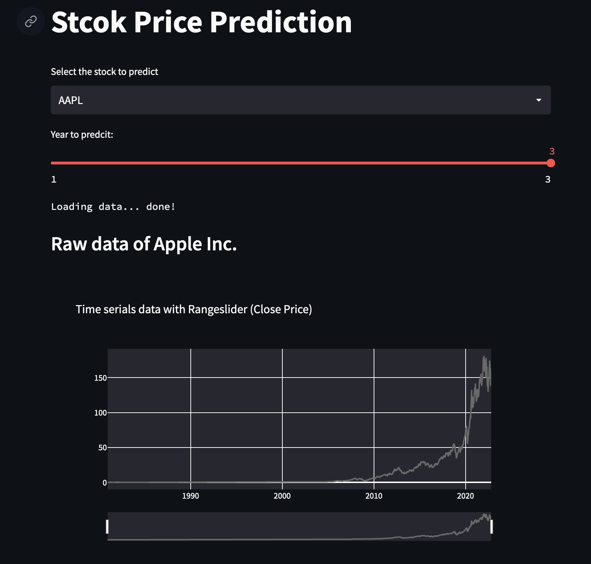

# Stock Price Prediction APP
## Streamlit web app to predict the stock future price
### This is only a toy model for the learning. Please do not use it on the market!!!
+ Get historical data of different stocks from Yahoo Finance. 
+ Predicted the future stock closing price from the historical data using Facebook Prophet up to 3 years. 
+ Visualized the prediction results by plotting interactive graphs using Plotly.

## How to use:
+ run locally:
  - install all the libraries in the requirements.txt
  - type the following command on the terminal: streamlit run app.py
+ public deployment:
  - link will be added soon
  
## Snapshot of the app:

